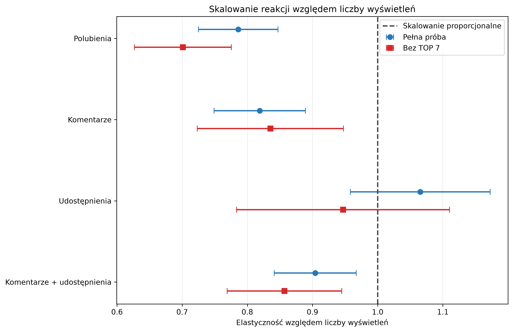

# TikTok Content Performance Analysis

Reproducible statistical analysis of engagement in a sample of 103 unique TikTok videos

This repository contains two completed modules from a larger content-performance analysis:

1. the relationship between views and Like Rate
2. the scaling of likes, comments, shares, and active reactions with views

## Views and Like Rate

### Research question

How did Like Rate change as the number of video views increased?

Like Rate is defined as:

$$
\text{Like Rate} =
\frac{\text{likes}}{\text{views}}
$$

### Main results

For the full sample of 103 videos:

- Spearman's rank correlation: $\rho_S = -0.7212$
- 95% bootstrap confidence interval: $[-0.7863,\,-0.6333]$
- log-log elasticity: $\hat{\beta} = -0.2139$
- coefficient of determination: $R^2 = 0.4300$

Videos with more views usually had a lower Like Rate

After excluding the seven most-viewed videos:

- Spearman's rank correlation: $\rho_S = -0.6993$
- log-log elasticity: $\hat{\beta} = -0.2987$
- coefficient of determination: $R^2 = 0.4750$

The relationship remained negative after excluding the viral tail

### Visualizations

#### Full sample


#### Sensitivity analysis without the top seven videos


## Reaction scaling

### Research question

How did the numbers of likes, comments, shares, and active reactions change as video reach increased?

Active reactions are defined as:

$$
\text{Active reactions} =
\text{comments} + \text{shares}
$$

Each reaction count was modelled using:

$$
\ln(Y) =
\alpha + \gamma \ln(\text{Views}) + \varepsilon
$$

The reference value is $\gamma = 1$, which represents proportional scaling with views

- $\gamma < 1$ indicates sublinear scaling and a decreasing reaction rate
- $\gamma = 1$ indicates proportional scaling and a stable reaction rate
- $\gamma > 1$ indicates superlinear scaling and an increasing reaction rate

### Estimated elasticities

| Reaction | Full sample | Without top seven | Interpretation |
|---|---:|---:|---|
| Likes | 0.786 | 0.701 | Sublinear |
| Comments | 0.819 | 0.835 | Sublinear |
| Shares | 1.065 | 0.947 | Approximately proportional |
| Active reactions | 0.904 | 0.857 | Sublinear |

### Key findings

- likes and comments grew more slowly than views
- shares scaled approximately proportionally with views
- shares scaled significantly faster than likes
- the difference between shares and likes remained after excluding the seven most-viewed videos
- the difference between shares and comments was sensitive to the viral tail



## Methods

The analyses use:

- scatter plots with a logarithmic views axis
- LOWESS with local linear fits and robust residual reweighting
- Spearman's rank correlation
- percentile bootstrap confidence intervals based on 10,000 resamples
- log-log regression models
- HC3 robust standard errors
- tests against proportional scaling
- paired bootstrap comparisons of reaction elasticities
- sensitivity analyses excluding the seven most-viewed videos

## Repository structure

```text
data/public/
    views_like_rate_public.csv
    reaction_scaling_public.csv

figures/
    views_like_rate_lowess.png
    views_like_rate_without_top7.png
    reaction_elasticities.png

results/
    reaction_elasticities.csv
    reaction_elasticity_differences.csv

sql/
    public_analysis.sql

src/
    like_rate_views.py
    reaction_scaling.py

like_rate_views.pdf
like_rate_views.tex
reaction_scaling.pdf
reaction_scaling.tex
requirements.txt
```

## SQL layer

`sql/public_analysis.sql` defines an analysis-ready MariaDB view that joins video metrics, anonymized speakers, formats, and qualitative content scores.

The public view excludes original identifiers, private documentation, topics, and experimental composite indices.

The SQL file contains only the view definition. The underlying private tables and data are not published.

The Python analyses remain fully reproducible from the two anonymized public datasets.

## Reproduction

The project was prepared for Python 3.13

Create the environment and install the dependencies:

```powershell
uv venv --python 3.13
uv pip install -r requirements.txt
```

Run the Like Rate analysis:

```powershell
.\.venv\Scripts\python.exe .\src\like_rate_views.py
```

Run the reaction-scaling analysis:

```powershell
.\.venv\Scripts\python.exe .\src\reaction_scaling.py
```

Both scripts print the numerical results and recreate their output files

## Public data

The repository contains two anonymized public datasets

`views_like_rate_public.csv` contains:

- anonymous video identifier
- number of views
- number of likes
- Like Rate

`reaction_scaling_public.csv` contains:

- anonymous video identifier
- number of views
- number of likes
- number of comments
- number of shares

Source URLs, original identifiers, publication dates, speakers, topics, documentation, and qualitative annotations were removed

One duplicated video was excluded before the analyses

## Limitations

- the sample comes from one account and one observation period
- the study is observational and does not identify causal effects
- views and reactions may depend on content, format, speaker, topic, audience, and platform distribution
- the reaction counts are not independent because they come from the same videos
- excluding the top seven videos is a sensitivity analysis, not a claim that those observations are erroneous
- the results should not automatically be generalized to other accounts or platforms

## Reports

- [Views and Like Rate report](like_rate_views.pdf)
- [Reaction scaling report](reaction_scaling.pdf)