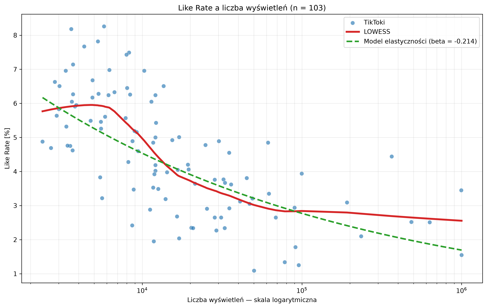
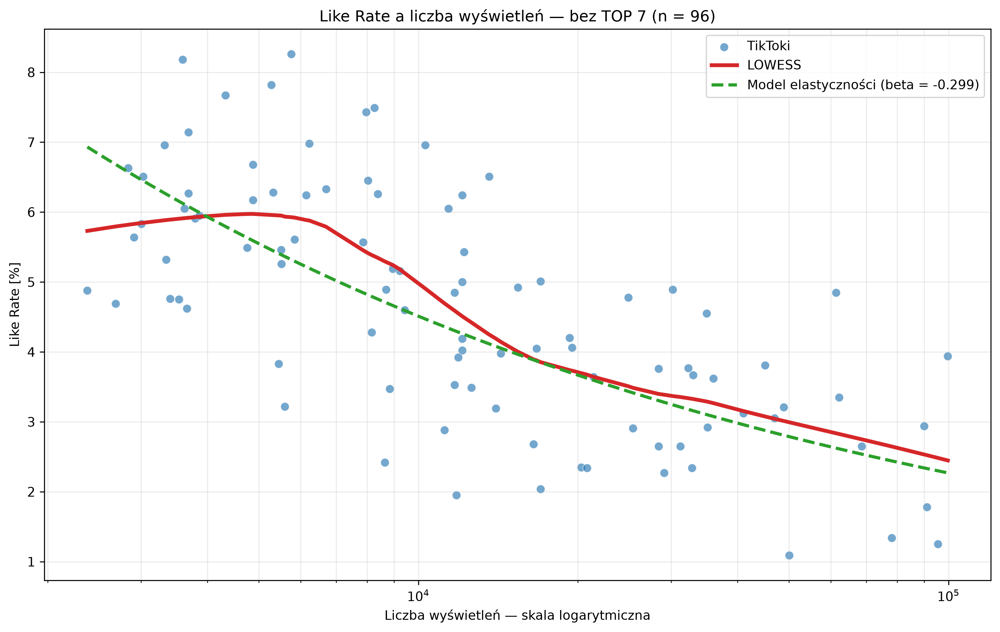

# TikTok Views and Like Rate Analysis

Exploratory analysis of the relationship between the number of views and Like Rate in a sample of 103 unique TikTok videos

This repository currently contains one completed statistical analysis from a larger data-analysis project

## Research question

How did Like Rate change as the number of video views increased?

Like Rate is defined as:

$$
\mathrm{Like\ Rate}=\frac{\mathrm{likes}}{\mathrm{views}}
$$

## Main results

For the full sample of 103 videos:

- Spearman's rank correlation: $\rho_S=-0.7212$
- 95% bootstrap confidence interval: $[-0.7863;\,-0.6333]$
- log--log elasticity: $\widehat{\beta}=-0.2139$
- model coefficient of determination: $R^2=0.4300$

The results indicate a strong negative association: videos with more views usually had a lower Like Rate

As a robustness analysis, the seven videos with the largest numbers of views were excluded. For the remaining 96 videos:

- Spearman's rank correlation: $\rho_S=-0.6993$
- log--log elasticity: $\widehat{\beta}=-0.2987$
- model coefficient of determination: $R^2=0.4750$

The direction of the relationship remained negative after excluding the viral tail. These results describe an association and should not be interpreted as evidence of causality

## Methods

- scatter plot with a logarithmic views axis
- LOWESS with local linear fits and robust residual reweighting
- Spearman's rank correlation
- percentile bootstrap confidence interval based on 10,000 resamples
- log--log elasticity model with HC3 robust standard errors
- robustness analysis excluding the seven largest videos by views

## Visualizations

### Full sample



### Robustness analysis without TOP 7



## Repository structure

```text
data/public/views_like_rate_public.csv   anonymized public dataset
figures/                                generated visualizations
src/like_rate_views.py                  reproducible statistical analysis
like_rate_views.pdf                     compiled analysis report
like_rate_views.tex                     LaTeX source of the report
```

## Reproduction

The project was prepared for Python 3.13

```powershell
uv venv --python 3.13
uv pip install -r requirements.txt
.\.venv\Scripts\python.exe .\src\like_rate_views.py
```

The script prints the numerical results and recreates both PNG files in the `figures` directory

## Public data

The public dataset contains only:

- anonymous video identifier
- number of views
- number of likes
- Like Rate

Source URLs, original identifiers, dates, speakers, topics and qualitative annotations were removed. One duplicated video was excluded before the analysis

To reproduce the values previously calculated in the database view, Like Rate is rounded to four decimal places before statistical estimation

## Limitations

- the sample comes from one account and one observation period
- the study is observational and does not identify a causal effect
- views and Like Rate may both depend on content, format, speaker, topic and platform distribution
- excluding TOP 7 is a robustness check, not a claim that those observations are erroneous

## Report

The complete mathematical description and interpretation are available in [like_rate_views.pdf](like_rate_views.pdf)
